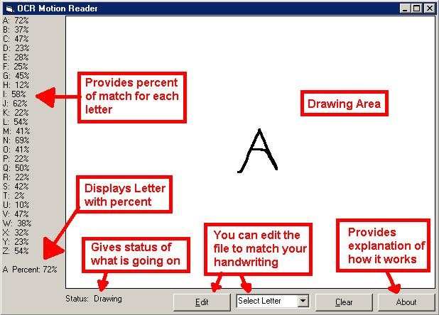

## Read \(OCR\) Movement

### Description

THis is my second program that can read. Its alot faster because it uses a completely different way to reconginze the letters. It also can be trained to your own hand writing. It uses the mouse movement instead of the pixels. The other program is at

http://www.planet-source-code.com/vb/scripts/showcode.asp?txtCodeId=35774&lngWId=1

that one is probably mroe accurate but a lot slower.
 
### More Info
 

             |
---                |---
**Submitted On**   |2002-06-13 12:36:20
**By**             |[chrisM\_808](https://github.com/Planet-Source-Code/PSCIndex/blob/master/ByAuthor/chrism-808.md)
**Level**          |Intermediate
**User Rating**    |5.0 (35 globes from 7 users)
**Compatibility**  |VB 3\.0, VB 4\.0 \(16\-bit\), VB 4\.0 \(32\-bit\), VB 5\.0, VB 6\.0
**Category**       |[Complete Applications](https://github.com/Planet-Source-Code/PSCIndex/blob/master/ByCategory/complete-applications__1-27.md)
**World**          |[Visual Basic](https://github.com/Planet-Source-Code/PSCIndex/blob/master/ByWorld/visual-basic.md)
**Archive File**   |[Read\_\(OCR\)939916132002\.zip](https://github.com/Planet-Source-Code/chrism-808-read-ocr-movement__1-35799/archive/master.zip)

